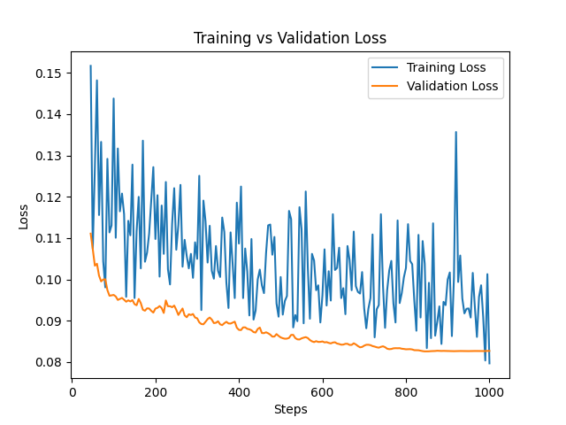
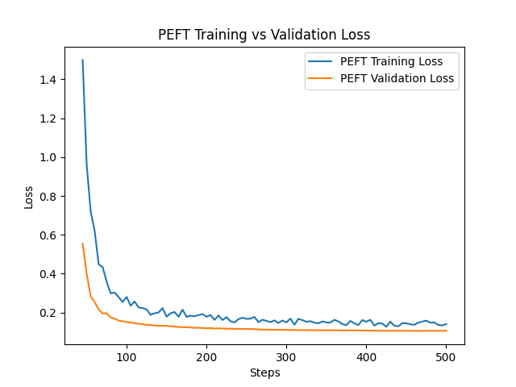
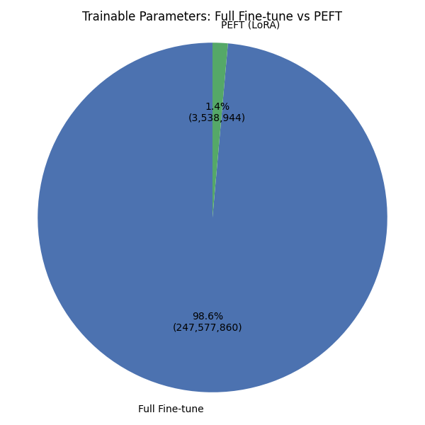
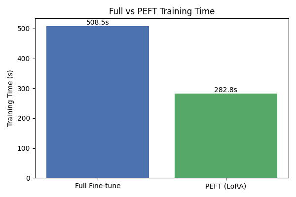
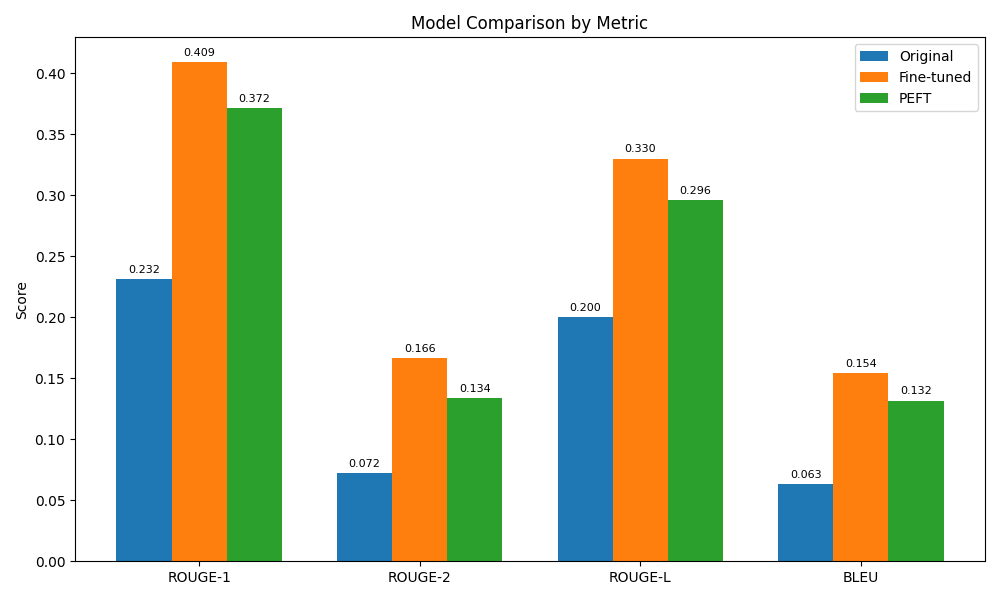

# Dialogue Summarization with FLAN-T5

This project explores dialogue summarization using the DialogSum dataset. Twovariants of the FLAN-T5 model were trained and evaluated against the original base model to understand the effects of different tuning strategies on performance.

## Overview

- **Base FLAN-T5**: The original model, used without any fine-tuning as a baseline.
- **Instruction-Fine-Tuned FLAN-T5**: Fine-tuned using full-parameter training with task-specific instructions for improved generalization.
- **PEFT Fine-Tuned FLAN-T5**: Parameter-Efficient Fine-Tuning implemented via adapters (e.g., LoRA), significantly reducing the number of trainable parameters while retaining performance.

### Base Model Information

This project uses the **FLAN-T5-base** model as the foundation for all experiments:

- **Model**: [google/flan-t5-base](https://huggingface.co/google/flan-t5-base)
- **Parameters**: ~248M parameters
- **Architecture**: T5-based encoder-decoder model fine-tuned on instruction-following tasks
- **Hugging Face Model Card**: Comprehensive documentation of capabilities, training data, and usage guidelines

The FLAN-T5 family includes multiple sizes. For reference:
- **FLAN-T5-small**: [google/flan-t5-small](https://huggingface.co/google/flan-t5-small) (80M parameters)
- **FLAN-T5-base**: [google/flan-t5-base](https://huggingface.co/google/flan-t5-base) (248M parameters) ⭐ *Used in this project*
- **FLAN-T5-large**: [google/flan-t5-large](https://huggingface.co/google/flan-t5-large) (780M parameters)
- **FLAN-T5-xl**: [google/flan-t5-xl](https://huggingface.co/google/flan-t5-xl) (3B parameters)
- **FLAN-T5-xxl**: [google/flan-t5-xxl](https://huggingface.co/google/flan-t5-xxl) (11B parameters)

## Dataset

- **Source**: [knkarthick/dialogsum](https://huggingface.co/datasets/knkarthick/dialogsum)
- **Description**: The DialogSum dataset consists of dialogue-summary pairs designed for the abstractive summarization of multi-turn conversations.

## Models and Training

### Hardware Setup

- **Platform**: High Performance Computing (HPC) Cluster
- **GPU**: NVIDIA A100 
- **Memory**: 80GB GPU Memory

### Training Configurations

1. **Base FLAN-T5**  
    - Used as the baseline for comparison.
    - No fine-tuning applied.

2. **Instruction-Fine-Tuned FLAN-T5**  
    - Fine-tuned on task-specific instructions.
    - Enhanced generalization by incorporating instruction-style prompts.

3. **PEFT Fine-Tuned FLAN-T5**  
    - Employed Parameter-Efficient Fine-Tuning using adapters.
    - Achieved competitive performance with a reduced number of trainable parameters.

## Results

### Training Statistics

| Model | Trainable Parameters | Total Parameters | Training Time (min) | Epochs | Learning Rate |
|-------|---------------------|------------------|-------------------|---------|---------------|
| **Instruction Fine-Tuned** | 247,577,856 | 247,577,856 | 8.48 | 400 | 0.001 |
| **PEFT Fine-Tuned** | 3,538,944 | 251,116,800 | 4.71 | 200 | 0.001 |

### Key Findings

- **Parameter Efficiency**: PEFT achieved competitive performance with **98.6% fewer trainable parameters** (3.5M vs 247.6M)
- **Training Efficiency**: PEFT required **44% less training time** (4.71 min vs 8.48 min)
- **Memory Efficiency**: PEFT uses only **1.4% of the parameters** that full fine-tuning requires

### Performance Comparison

The models were evaluated on dialogue summarization quality, with outputs stored in:
- `model_outputs/original_model_summaries.csv` - Base FLAN-T5 outputs
- `model_outputs/instruction_fine_tuned_model_summaries.csv` - Full fine-tuning outputs  
- `model_outputs/peft_model_summaries.csv` - PEFT outputs

### Visualizations

#### Training Loss Curves

**Full Fine-Tuning Loss Curves**

**PEFT Training Loss Curves**

#### Model Comparison Metrics

**Parameter Efficiency Comparison**

**Training Time Efficiency**

#### Performance Analysis

**Model Performance by Score Groups**

### Conclusion

This study demonstrates that **PEFT (Parameter-Efficient Fine-Tuning)** offers a highly effective approach for dialogue summarization:

1. **Significant resource savings** with minimal performance trade-offs
2. **Faster training convergence** compared to full fine-tuning
3. **Practical deployment advantages** due to smaller model footprint
4. **Cost-effective solution** for organizations with limited computational resources

The results validate PEFT as a superior approach for dialogue summarization tasks when computational efficiency is a priority.

## Future Work

### Next Phase Experiments

Building on the PEFT results, the next phase will implement:

1. **Proximal Policy Optimization (PPO)** - Apply reinforcement learning from human feedback to improve summary quality
2. **Model Distillation** - Create smaller, more efficient models while maintaining performance

These experiments will be tested on the same DialogSum dataset for direct performance comparison.
